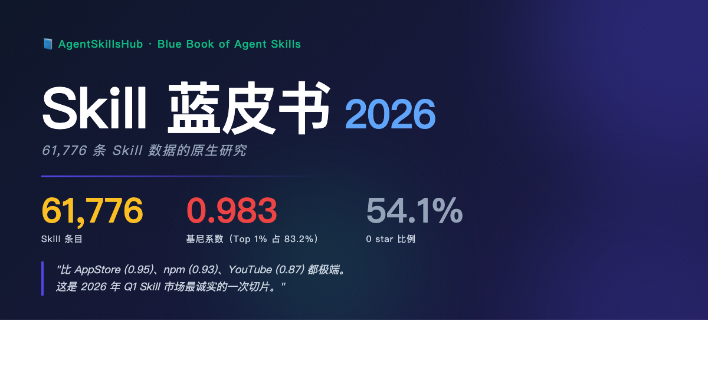
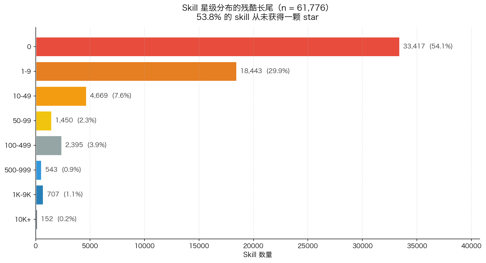
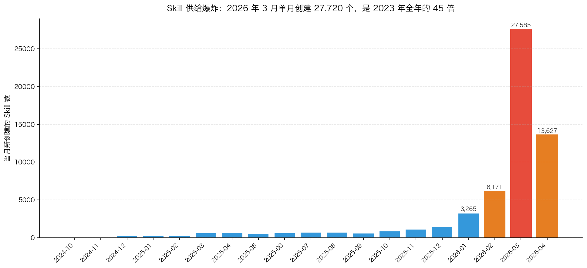
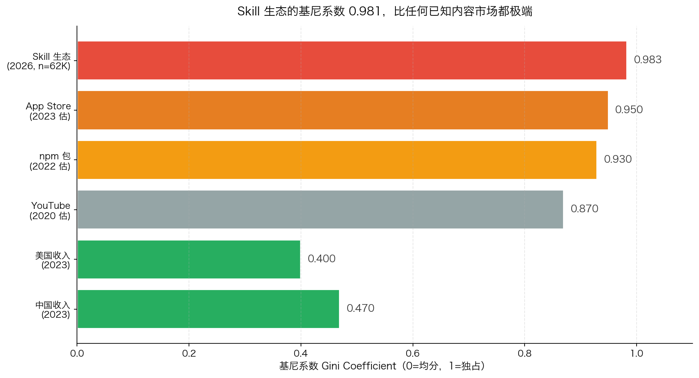
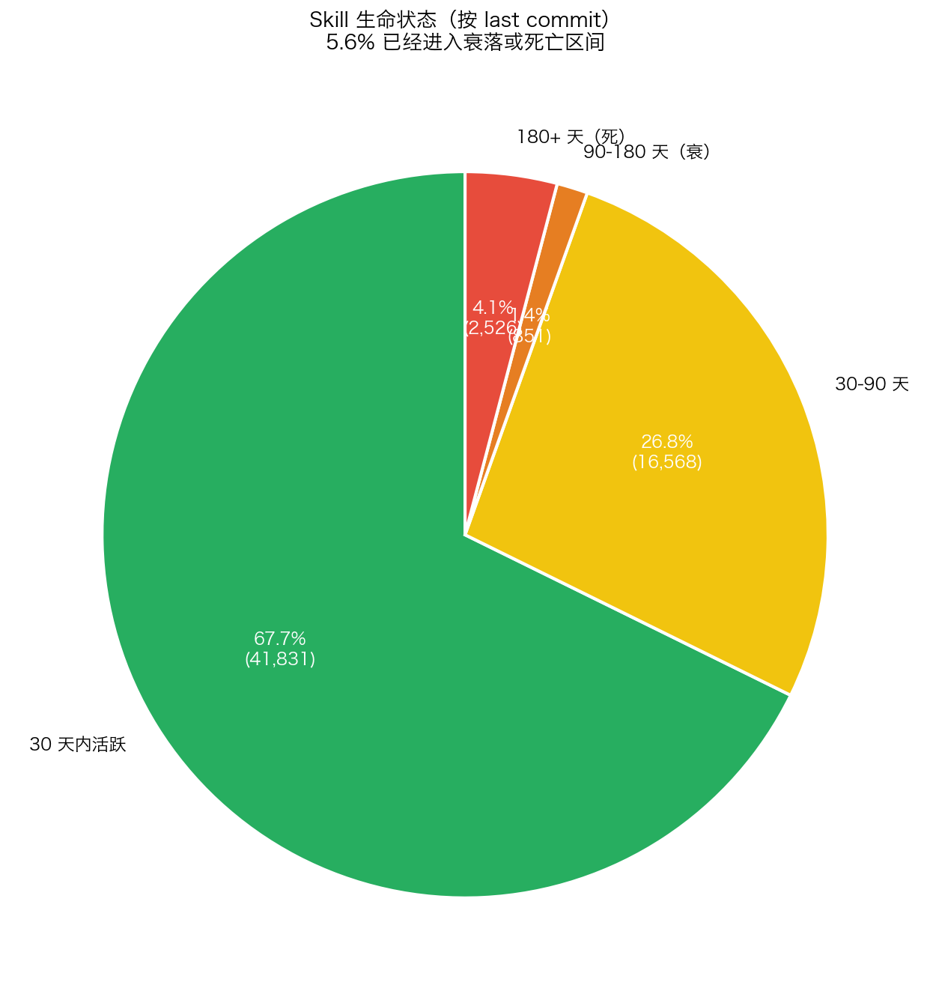

<div align="center">



# 📘 Skill 蓝皮书 2026

### Blue Book of Agent Skills

**基于 AgentSkillsHub 61,776 条 Skill 数据的原生研究报告**

[](https://github.com/zhuyansen/skill-blue-book/stargazers)
[](https://creativecommons.org/licenses/by-nc-sa/4.0/)
[](https://agentskillshub.top)
[](https://x.com/GoSailGlobal)

**[🌐 网站](https://agentskillshub.top)** · **[📖 Ch.3 市场全景](part1-foundation/ch03-market-landscape.md)** · **[📖 Ch.4 宝玉四条哲学](part2-practice/ch04-baoyu-four-principles.md)** · **[📖 Ch.5 迭代闭环](part2-practice/ch05-iteration-loop.md)** · **[📖 Ch.9 Distribution 第四条边](part3-ecosystem/ch09-distribution-fourth-edge.md)** · **[🐦 作者 X](https://x.com/GoSailGlobal)** · **[🔍 数据可复现](data/)**

</div>

---

> 「**55,000 个 Skill 里，超过一半是 0 star**。基尼系数 0.983——比 AppStore (0.95)、npm (0.93)、YouTube (0.87) 都极端。
>
> 这不是一本 Skill 教程。这是 2026 年 Q1 Skill 市场最诚实的一次切片。」

## 这本书是什么

一份关于 **AI Agent Skills 生态** 的行业报告 + 运营手记。

三个特点：

1. **基于真实数据** · 所有关键结论建立在 AgentSkillsHub 数据库 61,776 条 skill 的实测之上。所有分析脚本、数字快照、配图都在 `data/` 目录，随时可重跑验证。
2. **自我解剖** · 第 3 章就会暴露 Hub 自己的 4 个数据漏洞——不是护短，是倒逼问题解决。
3. **有立场** · "Distribution 是三角的第四条边"、"54% 的 Skill 从未被看见"、"Skill 半衰期 6-12 个月"——都是观点，不是共识。

## 这本书不是什么

- ❌ Anthropic 官方教程的重写
- ❌ Awesome 列表
- ❌ 创业心得（Hub 才上线 40 天，一切都太早）
- ❌ SaaS 或课程前置软广（蓝皮书本身免费）

---

## 📘 目录

### Part 1 · 基础：Skill 是什么

| # | 章节 | 状态 | 字数 |
|--:|:----|:----:|----:|
| 1 | [为什么需要 Skill：从 Mahesh 到 Barry](part1-foundation/ch01-mahesh-to-barry.md) | ✅ 初稿 | 8,000 |
| 2 | 三层渐进加载：Skill 的真正魔法 | 🔲 待写 | - |
| 3 | [**Skill 市场全景 2026**](part1-foundation/ch03-market-landscape.md) ⭐ | ✅ **完稿** | **8,500** |

### Part 2 · 实战：怎么写好 Skill

| # | 章节 | 状态 | 字数 |
|--:|:----|:----:|----:|
| 4 | [**站在 Agent 角度设计 Skill（宝玉四条哲学）**](part2-practice/ch04-baoyu-four-principles.md) ⭐ | ✅ **完稿** | **7,000** |
| 5 | [**迭代优化的闭环：从踩坑到飞轮**](part2-practice/ch05-iteration-loop.md) ⭐ | ✅ **完稿** | **6,500** |
| 6 | 9 种 Skill 类型 × 4 级分享路径 | 🔲 | - |

### Part 3 · 生态：Skill 正在吞噬一切

| # | 章节 | 状态 | 字数 |
|--:|:----|:----:|----:|
| 7 | 四大框架的对标与选择 | 🔲 | - |
| 8 | Skill 正在吞噬其他柱子 | 🔲 | - |
| 9 | [**Distribution：商业化三角少的那条边**](part3-ecosystem/ch09-distribution-fourth-edge.md) ⭐ | ✅ **完稿** | **7,000** |

### Part 4 · 实践：AgentSkillsHub 运营手记

| # | 章节 | 状态 |
|--:|:----|:----:|
| 10 | Verified Creator：不是花钱买的认证 | 🔲 |
| 11 | 咨询撮合 + 企业目录：Service-on-Open 怎么跑 | 🔲 |
| 12 | 未来：当 Claude 自己开始创建 Skills | 🔲 |

### 附录

- **A** · Skill 设计速查表
- **B** · AgentSkillsHub 使用指南
- **C** · Verified Creator 申请流程
- **D** · 参考文献 · 延伸阅读

---

## 🔥 第 3 章数字速览

<div align="center">

| 指标 | 数字 | 对比 |
|------|-----:|------|
| Skill 总量 | **61,776** | 2023 年 Q1 约 150 |
| 独立作者 | **33,314** | - |
| **基尼系数** | **0.983** | AppStore 0.95 / npm 0.93 |
| 0 star 比例 | **54.1%** | 33,417 个 Skill 从未被看见 |
| Top 1% 占 stars | **83.2%** | 617 个 skill 决定 83% 流量 |
| 2026-03 单月新增 | **27,720** | 2023 全年的 45 倍 |
| 180+ 天未更新 | **4.3%** | Skill 半衰期 6-12 个月 |

</div>

### 4 张核心图表

<div align="center">

| [](data/ch03-fig1-long-tail.png) | [](data/ch03-fig2-supply-surge.png) |
|:-:|:-:|
| **Fig 1** · 星级长尾分布 · 54.1% 0 star | **Fig 2** · 供给爆炸 · 3 月 27,720 新增 |
| [](data/ch03-fig3-gini-compare.png) | [](data/ch03-fig4-lifecycle.png) |
| **Fig 3** · 基尼系数对比 · Skill 0.983 | **Fig 4** · 生命状态 · 僵尸王清单 |

</div>

---

## 🔬 数据可复现

所有分析脚本公开：

```bash
# 克隆仓库
git clone https://github.com/zhuyansen/skill-blue-book.git
cd skill-blue-book

# 运行第 3 章的分析（需要 Supabase Key，见脚本注释）
python data/ch03_analysis.py
```

`data/ch03-stats.json` 是一份完整的数字快照（时间戳 2026-04-22），如果你拿到这本书时数字已经过时，脚本可以随时重新跑。

---

## 📮 阅读建议

- **想快速判断值不值得读**：先看 [第 3 章](part1-foundation/ch03-market-landscape.md)。那章有最扎实的数据，最没有"销售感"。
- **Skill 作者**：[第 5 章] 和 [第 10 章] 跟你直接相关
- **企业买家**：[第 11 章] 是你要看的
- **关心商业化**：从 [第 9 章] 开始，往回看就行

---

## 🤝 怎么引用

```bibtex
@misc{zhu2026skill,
  author = {Jason Zhu},
  title = {Blue Book of Agent Skills 2026},
  year = {2026},
  publisher = {AgentSkillsHub},
  url = {https://github.com/zhuyansen/skill-blue-book}
}
```

或者直接链接：`https://github.com/zhuyansen/skill-blue-book`

---

## 🐛 发现错误？

- **数据错误**：发 issue 或 [DM @GoSailGlobal](https://x.com/GoSailGlobal)
- **论点异议**：欢迎 PR 或 issue，附上你的证据
- **补充视角**：开 discussion

蓝皮书每季度修订一次。每次修订会在 CHANGELOG 里标注原因。

---

## 🙏 致谢

没有下面这些人的工作，这本书不存在：

- **[alchaincyf（花叔）](https://github.com/alchaincyf)** · 橙皮书系列给了这本书的形式启发
- **[lovstudio（南川）](https://x.com/lovstudio_AI)** · 《商业化三角不可能定理》是第 9 章的出发点
- **[JimLiu（宝玉）](https://github.com/JimLiu)** · Skills 设计哲学直接进入第 4 章
- **[Anthropic Skills 团队](https://github.com/anthropics/skills)** · 官方文档是这本书的地基
- **以及 61,776 个 Skill 的每一位作者**——包括那 33,417 个 0 star 作品的作者

---

## 📄 License

**CC BY-NC-SA 4.0** · [知识共享署名-非商业性使用-相同方式共享](https://creativecommons.org/licenses/by-nc-sa/4.0/deed.zh)

简单说：
- ✅ 可以免费阅读、下载、转发
- ✅ 可以引用段落（请注明出处 + 链接）
- ✅ 可以改写后再分享（需保持相同 License）
- ❌ 不可以商业性售卖或打包成付费课程

---

<div align="center">

### 🌐 相关链接

**网站**：[agentskillshub.top](https://agentskillshub.top)
**作者**：[Jason Zhu](https://x.com/GoSailGlobal) · [m17551076169@gmail.com](mailto:m17551076169@gmail.com)
**Hub 日报**：[Twitter Thread](https://x.com/GoSailGlobal) · 每天推送 AI Skill 新作 Top 10

</div>

<div align="center">
<sub>© 2026 Jason Zhu · AgentSkillsHub · CC BY-NC-SA 4.0</sub>
</div>
