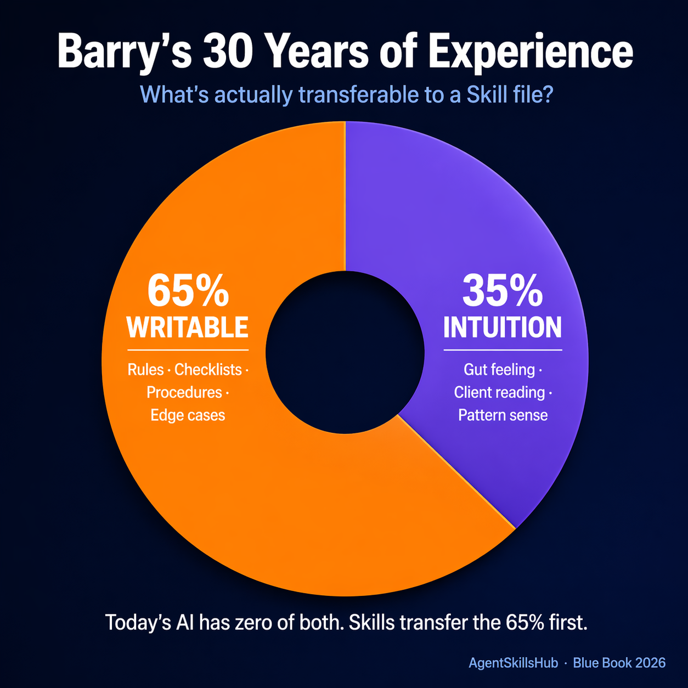
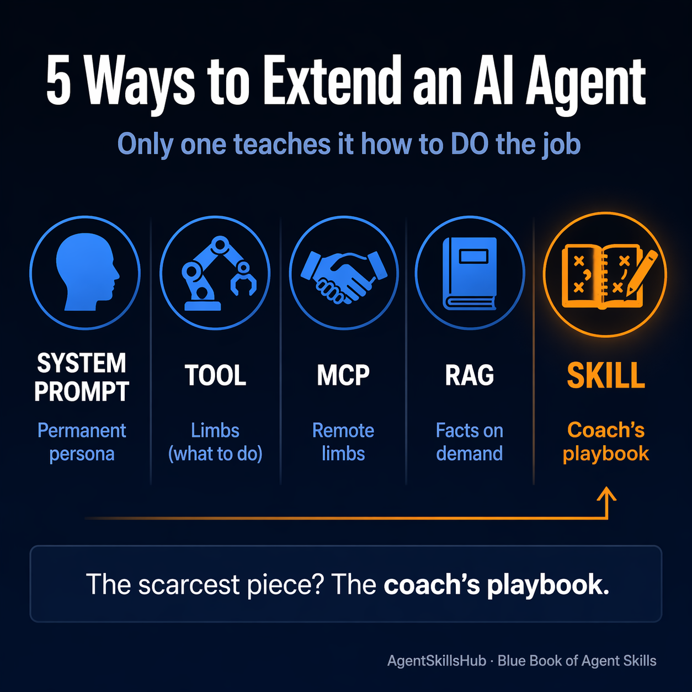

# 今天的 LLM 都是 MIT 博士，但 Agent 需要的是 30 年老会计

> 这是《Skill 蓝皮书 2026》的第 1 章公众号版。
> 完整 8,500 字版本 + 12 章目录：github.com/zhuyansen/skill-blue-book

---

## 一个让所有人停下来的类比

先讲 Anthropic 官方那篇 [*Stop Building Agents, Build Skills*](https://www.anthropic.com/engineering/agent-skills) 里的开场故事——

你开了一家税务事务所，要雇一个会计。

候选人 A 叫 **Mahesh**：MIT 数学博士，智商 150，记忆力极强，任何公式给他一眼他就能推导出来。刚毕业，没做过一天会计。

候选人 B 叫 **Barry**：社区大学学历，30 年税务经验，见过所有你能想到的客户场景——奇葩发票、跨国税务、政府稽查。他智商不算突出，但每个他遇到过的坑都记得。

**你会雇谁？**

答案几乎所有人都一样：**Barry**。

不是因为 Mahesh 不够聪明。是因为一家事务所需要的是"做过同类事一千次的人"，不是"理论上应该能做的人"。

今天的大语言模型——Claude、GPT、Gemini——**都是 Mahesh**。它们能在 10 秒内理解你公司的整个税务代码，能推导任何公式。但它们每次对话都从零开始——上一个客户的案例不会帮它们做好下一个客户。

一年前在帮你处理 DevOps 的那个 Agent，一年后还是同一个 Agent。**经验归零。**

---

## Skill 的本质：给 Mahesh 配 Barry 的小本子

Skill 就是那本"30 年经验"。每次开工前翻一下：

- 这类客户是 S-corp 要注意什么
- 上个月 IRS 发的通知怎么回
- 客户送的那张模糊发票可能是什么税种
- 合同里的"basis"通常指成本基准

Mahesh 还是那个 Mahesh。但他现在手里有 Barry 的 30 年。

**Skill 的定义**：一个装着"可写的经验"的文件夹，格式简单到任何人用电脑就能创建，但标准统一到 Claude 能自己读懂、自己决定什么时候用。

---

## 关键洞察：30 年经验里，60-70% 是可以写下来的

Anthropic 这个类比讲得很美，但藏了一个假设——**"经验"可以被写成文字传给下一个 Mahesh**。

这个假设对吗？**一部分对**。

**能被写的那部分（约 65%）**：
- "这类发票一律按 Schedule C 处理" ✓
- "IRS 的 Letter 2205 是稽查通知" ✓
- "客户说 'basis' 通常指成本基准" ✓

**不能被写的那部分（约 35%）**：
- "这个客户说话吞吞吐吐，肯定有事瞒着" ✗
- "这张发票金额不对，我闻得出来" ✗
- "这种案子你得先陪客户喝杯咖啡再谈业务" ✗

但这不是问题。**因为现在的 Mahesh 连那 65% 可写的经验都没有。** 把能写的部分先写出来传给它，已经能让它从"天才实习生"变成"合格中级"。

这就是 Skill 要解决的第一个问题：**把 65% 的显式经验，以最小摩擦传给下一个 Agent**。

---

## 为什么偏偏是 2026 年 Q1 才爆发

Anthropic 这个类比写于 2024 年。形式（文件夹 + SKILL.md）也不是新东西。但 Skill 真正爆发是在 **2026 年 Q1**——我统计了 AgentSkillsHub 里 62,000+ 条 skill 的数据，单月新增 **27,720 个**。是 2023 年全年的 45 倍。

为什么早不爆发、晚不爆发、偏偏是 2026 年 1-3 月？

答案不在 Skill 本身，在 **分发摩擦的消失**。

之前装一个 MCP Server 要 6 步：

> 1. 下源码 → 2. 配环境 → 3. 启动独立进程 → 4. 配端口 → 5. 重启 IDE → 6. 运气好的话能用

Skill 装法是 1 步：

> 把 `SKILL.md` 扔进 `~/.claude/skills/`

**门槛低 6 倍，用户基数就大 10 倍以上。**

2025 年 Q4 Claude Code 把 skill loading 做成一等公民。然后 Cursor、Codex、Windsurf 陆续支持同一个格式——**格式化压力**形成了。

类似的事情在别的行业发生过：**npm 之于 Node（2010）、Docker Hub 之于容器（2015）、Chrome 扩展之于浏览器（2012）**。Skill 现在走的是同一条路。

---

## 跟其他"让 AI 更聪明"的方案有什么区别

市面上一提到扩展 AI 能力，有 5 种方案。很多人搞不清楚 Skill 凭什么赢。

我用一个类比讲清楚：

- **Tool 是"四肢"**（能做什么）
- **MCP 是"独立的手"**（跨进程能做什么）
- **RAG 是"百科全书"**（事实检索）
- **System Prompt 是"永久人格"**（一直在线）
- **Skill 是"教练笔记"**（该怎么做）

Agent 真正最稀缺的，不是四肢，不是百科全书——是**教练笔记**。

**Tool 告诉你"能调 weather API"。Skill 告诉你"遇到旅行计划问题，你应该先问用户日期、再查天气、再组合建议"。**

这是 Skill 独有的生态位——它承载的是"怎么做"，不是"能做什么"。

---

## Skill 真正的野心：让 Claude 自己创建 Skills

如果只是"让 Mahesh 变成 Barry"，Skill 只是 Agent 能力的一个补丁。

但 Anthropic 在那篇原文里有一句话，被很多人忽略——

> "当 Claude 自己开始创建 Skills 的时候，系统会真正转起来。"

现在 Skill 还是人在写。人看到 Agent 反复犯同一个错，人写一个 Skill 教它。

**但想象一下**：如果 Claude 自己能检测"这类任务我反复出错"，然后自己总结出一个 Skill，下次遇到就激活——那就形成了真正的**经验积累闭环**。

Mahesh 变成了自己训练自己的 Barry。

这不是科幻。已经有 skill 在做这件事（cclank 的 news-aggregator-skill 里就有一个 `MISTAKES.md` 文件，作者把每次踩的坑写成规则反哺自己——这是人在为 Agent 攒经验的雏形）。只是现在还很早。

---

## 结论

**Skill 的本质是"把 Barry 的 30 年经验中可写的 65%，以最小摩擦传给下一个 Mahesh"。**

这件事在 2024 年是想法，在 2026 年 Q1 变成了事实上的工业标准——因为格式化压力终于到了。

2026 年 Q1 不是偶然，是 15 个月积累之后的**相变**。这也解释了为什么《Skill 蓝皮书》写在今天——再早，生态太小；再晚，市场已经分化、赢家已定。**现在是 Skill 市场最可以被定义的窗口。**

---

## 关于蓝皮书

《Skill 蓝皮书 2026》基于 [AgentSkillsHub](https://agentskillshub.top) 62,000+ 条 skill 的原始数据，共 12 章，预计 6-8 万字。目前已完稿：

- **第 1 章** · 为什么需要 Skill：从 Mahesh 到 Barry（本文的完整版 8,500 字）
- **第 3 章** · Skill 市场全景 2026（含基尼系数 0.983、54% 0-star 等独家数据）

其余章节每周更新，后续包括第 4 章"宝玉四条哲学 + 三个活案例"、第 9 章 "Distribution：商业化三角的第四条边"、第 12 章"当 Claude 自己开始创建 Skills"。

完整仓库：**[github.com/zhuyansen/skill-blue-book](https://github.com/zhuyansen/skill-blue-book)**

如果你是 Skill 作者、Agent framework 开发者、或者刚开始关注 Skill 生态——欢迎 star / issue / 拉同事一起读。

---

*作者：Jason Zhu（@GoSailGlobal），AgentSkillsHub 站长，专注于开源 AI Agent 生态观测。*
